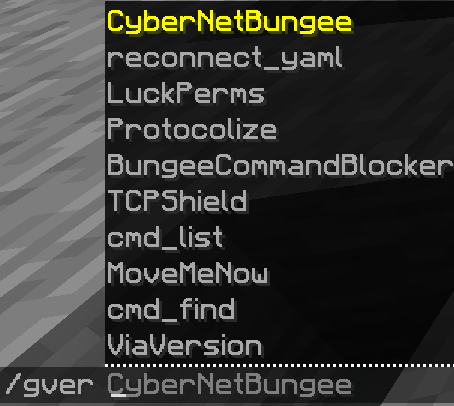

# CMD: Plugins
This is a module for Waterfall/Bungeecord! That means instead of putting it in the `plugins/` folder, you put it in 
the `modules/` folder!

# Installation
1) Go to [cmd_plugins releases](https://github.com/CyberedCake/cmd_plugins/releases/latest) and download the jar file.
2) Put the jar file in the `modules/` folder inside your server folder (where the server jar is, then click on the 
   "modules" folder there)
3) Restart your server with /end
4) Tada! Now you can do `/gversion` and `/gplugins` (the same as Bukkit's `/version` and `/plugins`)

# Info & Pictures
### The permission for the plugin commands are "bungeecord.command.plugins" and "bungeecord.command.version"

### Images:

