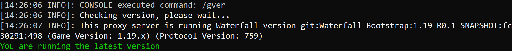
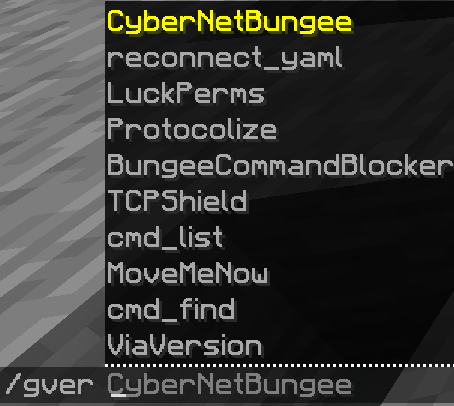

# CMD: Plugins
This is a Bungeecord plugin. You can put it in the `modules/` folder or `plugins/` folder. CMDPlugins also attempts to check for updates depending on your server software.

# Installation
1) Go to [cmd_plugins releases](https://github.com/CyberedCake/cmd_plugins/releases/latest) and download the jar file.
2) Put the jar file in the `plugins/` folder inside your server folder
3) Restart your server with /end
4) Tada! Now you can do `/gversion` and `/gplugins` (the same as Bukkit's `/version` and `/plugins`)

# Info & Pictures
### The permission for the plugin commands are "bungeecord.command.plugins" and "bungeecord.command.version"

### Images:

